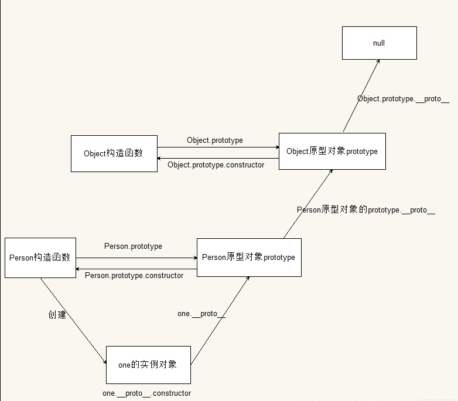

# 函数式编程

[toc]
## 1.疑问: 什么是函数式编程? 为什么学习函数式比编程?

### 1.1 什么是函数式编程?
函数式编程(FP)：(Functional Programming)函数式编程是一种编程范式,编程范式通俗的说就是一种编程思想(常听说的有面向过程编程,面向对象编程);

#### 1.1.1 什么是面向过程编程?

  面向过程编程(POP)：(Process-oriented programming)是一种以过程为中心的编程思想, 分析出解决问题的所需要的步骤,然后用函数把这些步骤一步一步实现,然后依次调用;

  经典案例: 就是把大象装进冰箱,用面向过程的方法需要几步?
  - 第一步:打开冰箱门
  - 第二步: 把大象装进冰箱
  - 第三步: 把冰箱门关上


#### 1.1.2. 什么是面向对象编程?

  面向对象编程(OOP)：(Object-oriented Programing)编程过程中把所涉及到的事物分解成一个个对象,然后由对象之间加工合作,就是(对象和方法)
  特性: 
  - 封装: 一个对象所封装的有自己的属性和方法,有点,降低耦合性,可重复调用某个类中的属性和方法
  - 继承: 继承是子对象可以继承父对象的属性和行为
    - 实现继承: ES语法只支持实现继承,主要依靠原型链实现的(参考下边)
    - 接口继承: 接口继承js中暂时无法实现
  - 多态: 通俗的讲就是同一个函数,因为传递的参数不同,可以实现的功能也不同
    案例: 把大象装冰箱
  - 对象有大象和冰箱
    - 大象
      - 方法: 钻进冰箱
    - 冰箱
      - 方法: 打开和关闭

**继承:** (通过查资料看博文参考)
  - 原型链继承
    - 回顾原型链:  
    ```js
      // 创建父级构造函数
      function Father(){
        this.x = 1;
      }
      Father.prototype.f = function(){
        console.log('我是父级原型上的方法');
      }
      // 创建子级构造函数
      function Son(){
          this.y = 2;
      }
      //继承 Father
      Son.prototype = new Father();//这样直接赋值会有问题,如果修改了子原型对象,父原型对象也会跟着一起变化
      Son.prototype.s = function(){
        console.log('我是子级原型上的方法');
      }
    ```
    **注意:** 
    - 缺点1:当原型链中包含引用类型值的原型时,该引用值会被所有实例共享;
    - 缺点2:创建子类型(创建Son实例),不能向父类(Father)的构造函数中传递参数;
  - 借用构造函数(经典继承)
    为了解决原型链的缺点:子构造函数继承父构造函数的属性(使用call方法改变this指向)
  ```js
    // 1. 父构造函数
    function Father(uname, age) {
      // this 指向父构造函数的对象实例
      this.uname = uname;
      this.age = age;
    }
    // 2 .子构造函数 
    function Son(uname, age, score) {
      // this 指向子构造函数的对象实例
      Father.call(this, uname, age);
      this.score = score;
    }
      var son = new Son('小明', 18, 100);
      console.log(son);
  ```
   **注意:** 
    - 1. 保证了原型链中引用类型值不被所有实例共享,子级创建时也可以向父级传递参数
    - 2. 子类要想引用父类的方法,使用不了
  - 组合继承
    将原型链继承和借用构造函数继承组合在一起
   ```js
    // 1. 父构造函数
    function Father(uname, age) {
      // this 指向父构造函数的对象实例
      this.uname = uname;
      this.age = age;
    }
    Father.prototype.f = function() {
      console.log('我是父级原型方法')
    }
    // 2 .子构造函数 
    function Son(uname, age, score) {
      // this 指向子构造函数的对象实例
      Father.call(this, uname, age);
      this.score = score;
    }
   
    // Son.prototype = Father.prototype;  这样直接赋值会有问题,如果修改了子原型对象,父原型对象也会跟着一起变化
      Son.prototype = new Father();
      // 如果利用对象的形式修改了原型对象,别忘了利用constructor 指回原来的构造函数
      Son.prototype.constructor = Son;
      Son.prototype.bb = function() {
        console.log('woshi1slsdlfldsj');
      }
      var son = new Son('小明', 18, 100);
      son.f(); // 我是父级原型方法
      son.bb(); // 我是父级原型方法
      console.log(son);
  ```
  - 原型继承
  ```js
    // 父构造函数
		function Father(x) {
			this.x = x
		}
    // 父构造函数原型上的属性和方法
		Father.prototype.aa = 11
		Father.prototype.a2 = function() {
      console.log('我是父亲的原型的方法')
    }
    // 子构造函数
		function Son(y) {
			this.y = y
    }
    // 子构造函数原型上的属性
    Son.prototype.b = 112211;

    // 重置Son.prototype的值,先保存自己的原型
    const originProto = Son.prototype;
    //自己的原型指向父亲的实例对象
    Son.prototype = new Father();
    //构造器指向构造出自己的构造函数
    Son.prototype.constructor = Son;
    // 把孩子自身原型身上的属性和方法给带上,不能忘掉
    for(let prop in originProto) {
        Son.prototype[prop] = originProto[prop]
    }
    const p2 = new Father()
    const c2 = new Son('c2')
    //孩子身上没有, 继承了父亲的所有属性和方法
    //1.打印继承了父亲的属性
    console.log(c2.aa)
    //2.调用继承了父亲身上的方法
    c2.a2()
    // 3.打印一下自己身上以及原型上的属性级方法
    console.log('c2:', c2)
  ```
  - 寄生式继承
  - 寄生组合继承
  - ES6类继承extends

### 1.2 为什么要学函数式编程?

1. React的高阶组件使用了高阶函数来实现,高阶函数就是函数式编程的一个特性,Redux也使用了函数式编程的思想
2. Vue3也开始拥抱函数式编程
3. 函数式编程可以抛弃this
4. 打包过程中可以更好地利用tree shaking过滤无用代码
5. 方便测试,方便进行处理
6. 函数式编程开发的一些库(lodash,underscore,ramda)

### 函数式编程思维方式理解
- 程序的本质: 根据输入通过某种运算得到相应的结果
- 函数式编程中的函数不是程序中的Function,而是数学中的函数映射关系,如:y=sin(x)
- 相同的输入时得到相同的输出(纯函数)
- 函数式编程描述数据(函数)之间的映射


